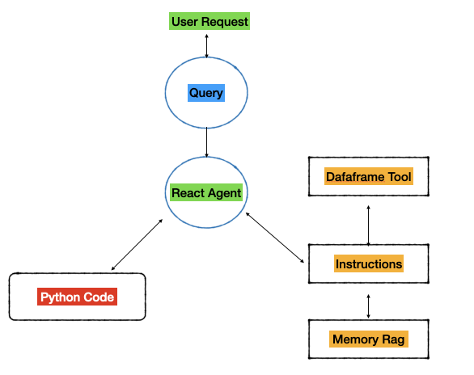
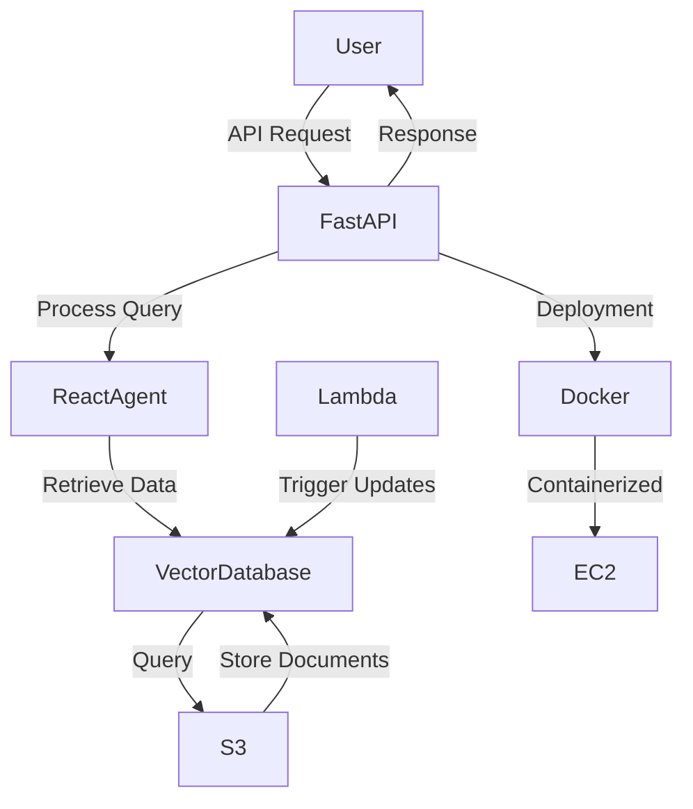

### Question :
Describe the architecture you would use to build this LLM agent, focusing on optimizing prompt engineering to achieve the best results. What strategies would you use to design effective prompts for different use cases (e.g., customer support, information retrieval)?


### Response 
The strategy for this architecture focuses on two key aspects:

Attention mechanisms
Understanding and information retrieval
Understanding that there must be an optimization component at the prompt level, the challenge extends to optimizing memory usage and employing multiple comprehension agents to avoid bias or hallucination in the responses. Therefore, the internal behavior of the application should follow this structure:


This image represents the following:



* The user makes a request that is handled by a React Agent.
* The agent queries a vectorized database, for example, a database using Sklearn (SKLearnVectorStore).
* The agent searches for a vector containing the most relevant information to answer the request.
* The above implies a tool design as follows:

    + LangChain will be employed for memory management (ConversationBufferMemory).
    + Vector search will adhere to specific search filters. 
    + Redundant information will be removed per query.

The result is:


```{bash}
q1/
├── main.py                
├── modules/
│   ├── data_loader.py     
│   ├── vector_store.py    
│   ├── memory.py          
│   ├── agent.py           
└── utils/
    ├── config.py          
├── MLproject              
├── conda.yaml             
       
```

1. Conda.yaml
```{bash}
name: task1
channels:
  - defaults
  - conda-forge
dependencies:
  - python=3.10
  - pip=24 .0
  - boto3=1.28.0
  - langchain=0.0.206
  - mlflow=2.7.1
  - openai>=0.27.0
  - python-dotenv=1.0.0
  - scikit-learn=1.2.2
  - pandas=1.5.3
  - pyarrow=12.0.1
  - pip:
      - langchain-openai==0.0.4
```
2. main

```{Python}
#===================#
# --- libraries --- #
#===================#

import argparse
from modules.data_loader import load_documents_from_s3
from modules.vector_store import create_vector_store
from modules.memory import get_conversation_memory
from modules.agent import create_agent
from dotenv import load_dotenv
import os

def main(bucket_name: str, persist_path: str, query: str):
    """
    Main function to execute the LLM-based document retrieval system.

    This function loads documents from an S3 bucket, creates a vector store for 
    efficient retrieval, initializes conversation memory, and configures a React Agent 
    to handle user queries.

    Parameters
    ----------
    bucket_name : str
        The name of the AWS S3 bucket to fetch documents from.
    persist_path : str
        Path to save the vectorized database.
    query : str
        The query to run against the agent.

    Examples
    --------
    Command-line usage:
    $ python main.py --bucket_name my-bucket --persist_path ./vector_store --query "What is AWS S3?"

    """
    # Load environment variables
    load_dotenv()
    AWS_ACCESS_KEY = os.getenv("AWS_ACCESS_KEY")
    AWS_SECRET_KEY = os.getenv("AWS_SECRET_KEY")
    OPENAI_API_KEY = os.getenv("OPENAI_API_KEY")

    if not all([AWS_ACCESS_KEY, AWS_SECRET_KEY, OPENAI_API_KEY]):
        raise ValueError("Missing required environment variables. Check .env file.")

    # Step 1: Load documents from S3
    print(f"Loading documents from bucket: {bucket_name}...")
    documents = load_documents_from_s3(bucket_name, AWS_ACCESS_KEY, AWS_SECRET_KEY)
    print(f"Loaded {len(documents)} documents.")

    # Step 2: Create vector store
    print(f"Creating vector store at path: {persist_path}...")
    vector_store = create_vector_store(documents, persist_path, OPENAI_API_KEY)

    # Step 3: Initialize memory
    print("Initializing conversation memory...")
    memory = get_conversation_memory()

    # Step 4: Create agent
    print("Creating React Agent...")
    agent = create_agent(vector_store, memory, OPENAI_API_KEY)

    # Step 5: Run agent with query
    print(f"Running agent for query: '{query}'...")
    response = agent.run(query)
    print("\nAgent Response:")
    print(response)


if __name__ == "__main__":
    parser = argparse.ArgumentParser(
    description="Run an LLM-based document retrieval system.")
    parser.add_argument("--bucket_name", 
        type=str, 
        required=True, 
        help="Name of the AWS S3 bucket")
    parser.add_argument("--persist_path", 
        type=str, 
        required=True,
         help="Path to persist the vector store")
    parser.add_argument("--query", 
        type=str, 
        required=True, 
        help="Query to process with the agent")
    args = parser.parse_args()

    main(args.bucket_name, args.persist_path, args.query)

```

3. MLproject
```{yaml}
name: llm_aws_agent

conda_env: conda.yaml

entry_points:
  main:
    parameters:
      bucket_name: {type: str, default: "my-bucket"}
      persist_path: {type: str, default: "./vector_store"}
      query: {type: str, default: "What is AWS S3?"}
    command: "python main.py --bucket_name {bucket_name} --persist_path {persist_path} --query {query}"
```

4. DataLoader

```{python}
from langchain.document_loaders import S3Loader

def load_documents_from_s3(bucket_name: str, aws_access_key: str, aws_secret_key: str):
    """
    Load documents from an AWS S3 bucket.

    This function connects to an S3 bucket using the provided credentials and retrieves
    documents for further processing. It uses LangChain's S3Loader to streamline the
    loading process.

    Parameters
    ----------
    bucket_name : str
        The name of the AWS S3 bucket.
    aws_access_key : str
        The AWS access key for authentication.
    aws_secret_key : str
        The AWS secret key for authentication.

    Returns
    -------
    list
        A list of documents retrieved from the S3 bucket.

    Examples
    --------
    >>> load_documents_from_s3("example-bucket", "ACCESS_KEY", "SECRET_KEY")
    [Document(page_content="...", metadata={"source": "file1"})]
    """
    loader = S3Loader(
        aws_access_key_id=aws_access_key,
        aws_secret_access_key=aws_secret_key,
        bucket_name=bucket_name,
    )
    return loader.load()
```

5. Vector Store 

```
from langchain.vectorstores import SKLearnVectorStore
from langchain_openai import OpenAIEmbeddings

def create_vector_store(documents, persist_path: str, openai_api_key: str):
    """
    Create a vectorized database for efficient information retrieval.

    This function takes a list of documents and creates a vector store using OpenAI embeddings.
    The vector store is saved locally in the specified path for persistence.

    Parameters
    ----------
    documents : list
        A list of documents to vectorize.
    persist_path : str
        Path to save the vectorized database.
    openai_api_key : str
        API key for OpenAI to generate embeddings.

    Returns
    -------
    SKLearnVectorStore
        An instance of the vector store containing the vectorized documents.

    Examples
    --------
    >>> create_vector_store(docs, "./vector_store", "OPENAI_API_KEY")
    <SKLearnVectorStore>
    """
    embedding_function = OpenAIEmbeddings(openai_api_key=openai_api_key)
    vector_store = SKLearnVectorStore.from_documents(
        documents=documents,
        embedding=embedding_function,
        persist_path=persist_path,
        serializer="parquet",
    )
    vector_store.persist()
    return vector_store
```

6. Memory

```
from langchain.memory import ConversationBufferMemory

def get_conversation_memory():
    """
    Initialize a memory instance for conversation history.

    This function creates a conversation memory using LangChain's `ConversationBufferMemory`.
    It allows the agent to retain a record of previous interactions to provide context-aware responses.

    Returns
    -------
    ConversationBufferMemory
        A memory instance for managing conversation history.

    Examples
    --------
    >>> memory = get_conversation_memory()
    >>> memory.save_context({"input": "Hi"}, {"output": "Hello"})
    """
    return ConversationBufferMemory(memory_key="chat_history", return_messages=True)
```

7. Agent 

```
from langchain.agents import initialize_agent, Tool
from langchain_openai import ChatOpenAI

def create_agent(vector_store, memory, openai_api_key: str):
    """
    Create a React Agent with tools for vector search and memory.

    This function initializes a React Agent capable of interacting with tools such as
    vector search and contextual memory. The agent uses LangChain's `initialize_agent`
    and OpenAI's language models.

    Parameters
    ----------
    vector_store : SKLearnVectorStore
        The vector store for document retrieval.
    memory : ConversationBufferMemory
        The memory instance for managing conversation history.
    openai_api_key : str
        API key for OpenAI to power the agent's LLM.

    Returns
    -------
    AgentExecutor
        A configured React Agent ready to process user queries.

    Examples
    --------
    >>> agent = create_agent(vector_store, memory, "OPENAI_API_KEY")
    >>> response = agent.run("What are AWS S3 durability features?")
    """
    tools = [
        Tool(
            name="Vector Search",
            func=vector_store.similarity_search,
            description="Search for documents related to a query."
        )
    ]
    llm = ChatOpenAI(temperature=0, openai_api_key=openai_api_key)
    agent = initialize_agent(
        tools=tools,
        llm=llm,
        memory=memory,
        agent="react-description",
        verbose=True
    )
    return agent
```


### Explanation of the Architecture and Prompt Engineering Strategies


### **Step-by-Step Explanation**

#### **1. Document Ingestion (Data Loader)**
**Purpose:** Load domain-specific documents from an AWS S3 bucket into the system.  
- The `data_loader.py` module fetches unstructured documents using secure access credentials. This step ensures the agent has access to a corpus of relevant knowledge for answering queries.  
- This supports use cases like **customer support** by providing the agent with up-to-date company policies or **information retrieval** from technical documentation.

*Why it's important:*  
Without relevant documents, the agent's responses are generic and lack context. Loading specific documents tailors the agent’s knowledge to its intended domain.


#### **2. Vectorization of Knowledge Base (Vector Store)**
**Purpose:** Transform the documents into a searchable, vectorized database using OpenAI embeddings.  
- The `vector_store.py` module creates embeddings from the documents, storing them in a persistent database optimized for **semantic similarity searches**.
- This database allows the agent to perform contextual lookups and retrieve the most relevant chunks of information.

*Why it's important:*  
This ensures the agent focuses on specific information, reducing the risk of irrelevant or overly verbose answers. Semantic similarity enables it to match user queries to relevant content even if the wording differs.


#### **3. Conversation Memory**
**Purpose:** Retain context over multiple interactions with users.  
- The `memory.py` module implements a **conversation buffer memory** that allows the agent to understand the flow of dialogue and provide coherent responses in multi-turn interactions.
- For **customer support**, this is crucial as users often ask follow-up questions related to earlier interactions.

*Why it's important:*  
Memory helps the agent provide contextual, human-like responses and avoids redundancy by remembering prior questions or answers.


#### **4. React Agent for Query Resolution**
**Purpose:** Combine tools and reasoning to answer queries dynamically.  
- The `agent.py` module creates a **React Agent**, which integrates:
  1. **Vector Search Tool:** Retrieves relevant knowledge from the vector store.
  2. **LLM Tool:** Uses OpenAI’s GPT model for natural language generation and reasoning.
- The agent uses a reasoning-action-observation cycle to interact with the tools iteratively until it resolves the user query.

*Why it's important:*  
This modular, tool-driven design makes the agent versatile. It can answer fact-based queries using the vector search and generate well-reasoned, context-aware responses through the LLM.


#### **5. Prompt Engineering for Optimization**
**Purpose:** Tailor LLM behavior to specific use cases by crafting effective prompts.  
Strategies include:
- **Case-Specific Templates:**  
  For **customer support:**
  ```plaintext
  You are a professional customer support assistant. Be concise and empathetic. Question: {query}.
  ```
  For **information retrieval:**
  ```plaintext
  Act as a technical expert. Retrieve the most relevant details for the query: {query}.
  ```
- **Prompt Chaining:**  
  Break complex queries into smaller, manageable sub-tasks and chain the results.  
  Example:
  1. Identify the user’s main intent.
  2. Retrieve relevant content.
  3. Summarize and respond.

- **Few-Shot Examples:**  
  Embed examples in prompts to guide the LLM on tone and structure:  
  ```plaintext
  Example 1:  
  Q: How does AWS S3 ensure durability?  
  A: AWS S3 uses data replication across multiple availability zones to ensure durability.

  Now answer this question: {query}.
  ```


#### **6. User Interaction via CLI or MLflow**
**Purpose:** Make the system accessible and easy to run.  
- **CLI Execution:** Users can interact with the system through the `main.py` script, providing parameters such as the S3 bucket name, query, and storage path.
- **MLflow Integration:** The system is packaged as an MLflow project, enabling version control, parameter configuration, and deployment.

*Why it's important:*  
Accessibility ensures that the system can be tested, iterated, and deployed seamlessly, which is critical for startup environments.


### **Summary**

1. **Optimizing Prompt Engineering:**  
   The system uses tailored prompt templates, chaining, and few-shot examples to align the LLM’s behavior with specific use cases (e.g., customer support or technical information retrieval). These strategies ensure clarity, relevance, and a professional tone in responses.

2. **Scalable Architecture:**  
   By modularizing components (e.g., data loading, vectorization, memory, and agent tools), the system is easy to extend and adapt to new domains or use cases.

3. **High-Quality Responses:**  
   The vector store ensures that the agent retrieves accurate, contextually relevant information, while the LLM refines and delivers polished responses.

4. **Continuous Evaluation:**  
   The design includes components for persistence (vector store) and flexibility (prompt engineering), enabling iterative improvements based on feedback and performance metrics.


### Updated Response: Extending the Architecture to API Deployment with FastAPI, Docker, and AWS Lambda

---

#### **Adding API and Deployment Capabilities**

To make this system accessible in real-world scenarios, we propose extending the architecture to include an API layer, containerization for portability, and deployment on cloud infrastructure. This involves:

1. **FastAPI**: Provides a lightweight and high-performance API framework for serving the LLM agent.
2. **Docker**: Ensures consistency and portability across development and production environments.
3. **AWS Lambda**: Acts as a trigger for event-driven tasks.
4. **AWS EC2**: Hosts the deployed application for scalable usage.

---

### **Deployment Architecture**

#### **1. API with FastAPI**
FastAPI serves as the interface for handling user queries. Key features:
- **Endpoints**: Define routes like `/query` to receive user input and return responses.
- **Integration**: Connect the API to the LLM agent (React Agent) for backend processing.

#### **2. Containerization with Docker**
- Ensures that the application is portable and reproducible across environments.
- A multi-stage Dockerfile is used to build, test, and deploy the application efficiently.

#### **3. AWS Lambda Trigger**
- Triggers specific tasks, such as loading updated documents into the vector database, based on predefined events like S3 uploads.

#### **4. Hosting on AWS EC2**
- The application is deployed on an EC2 instance, providing a scalable and reliable environment for hosting the API.

---

### **Mermaid Diagram**

Here is a visual representation of the deployment architecture:



---

### **Multi-Stage Dockerfile**

Below is the Dockerfile adapted for our FastAPI project, designed with portability, modularity, and testing in mind:

```{dockerfile}
# Experiment Object API Dockerfile
#
# Copyright 2025
# Test setup for FastAPI-based LLM agent deployment
# 
# This file includes multi-stage builds for production, testing, and development.

ARG PYTHON_VERSION=3.9.19
FROM python:${PYTHON_VERSION}-slim as base

# Set working directory
WORKDIR /src

# Create a non-privileged user
ARG UID=10001
RUN adduser \
    --disabled-password \
    --gecos "" \
    --home "/app/project" \
    --shell "/sbin/nologin" \
    --uid "${UID}" \
    appuser \
    && chown appuser /app/project \
    && chown appuser /src

RUN apt-get update \
  && apt-get -y install gcc g++ unixodbc unixodbc-dev libgssapi-krb5-2 \
  && apt-get clean

# Copy requirements
COPY ./requirements.txt /src/requirements.txt

# Set environment variables
ENV PYTHONUSERBASE=/app/project/.local/bin
ENV PATH=$PYTHONUSERBASE/bin:$PATH
ENV PIP_USER=yes
ENV PYTHONPATH="${PYTHONPATH}:/app/project/.local/bin"

# Install dependencies
USER appuser
RUN pip install --upgrade pip \
    && pip install --no-cache-dir -r /src/requirements.txt

# Production stage
FROM base AS production
USER appuser
COPY ./src /src/app
EXPOSE 8000
CMD ["uvicorn", "app.main:app", "--host=0.0.0.0", "--port=8000"]

# Testing stage
FROM base AS testing
WORKDIR /
USER appuser
RUN pip install httpx pytest pytest-dotenv pytest-cov pytest-xdist pytest-mock \
    && echo "Testing suite installed"
COPY ./tests/ src/tests/
COPY ./src src/src

# Unit tests
FROM testing as unit_test
USER root
CMD bash -c "pytest --cov-config=.coveragerc src/tests/unit_test --junitxml=reports/unittest-${PYTHON_VERSION}.xml --cov-report=xml:reports/coverage-${PYTHON_VERSION}.xml --cov-report=html:reports/coverage_report-${PYTHON_VERSION} -n 3 --cov=src"

# Integration tests
FROM testing as integration_test
USER root
CMD bash -c "pytest --cov-config=.coveragerc src/tests/integration_test --junitxml=reports/pytest-${PYTHON_VERSION}.xml --cov-report term-missing --cov=src | tee reports/pytest-coverage-${PYTHON_VERSION}.txt"
```

---

### **API Implementation**

The following FastAPI implementation provides a `/query` endpoint to process user queries via the React Agent.

```{python}
from fastapi import FastAPI, HTTPException
from pydantic import BaseModel
from modules.agent import create_agent
from modules.data_loader import load_documents_from_s3
from modules.vector_store import create_vector_store
from modules.memory import get_conversation_memory
from dotenv import load_dotenv
import os

app = FastAPI()

# Load environment variables
load_dotenv()
AWS_ACCESS_KEY = os.getenv("AWS_ACCESS_KEY")
AWS_SECRET_KEY = os.getenv("AWS_SECRET_KEY")
OPENAI_API_KEY = os.getenv("OPENAI_API_KEY")
VECTOR_STORE_PATH = "./vector_store"

# Initialize global components
memory = get_conversation_memory()

# Request model
class QueryRequest(BaseModel):
    query: str

@app.post("/query")
async def process_query(request: QueryRequest):
    try:
        # Load vector store (assume preloaded for production)
        documents = load_documents_from_s3("my-bucket", AWS_ACCESS_KEY, AWS_SECRET_KEY)
        vector_store = create_vector_store(documents, VECTOR_STORE_PATH, OPENAI_API_KEY)
        
        # Create React Agent
        agent = create_agent(vector_store, memory, OPENAI_API_KEY)
        
        # Process query
        response = agent.run(request.query)
        return {"response": response}
    except Exception as e:
        raise HTTPException(status_code=500, detail=str(e))
```

---

### **Summary**

1. **FastAPI Integration:** A simple, performant API to handle user queries and return responses from the LLM agent.
2. **Docker for Portability:** Multi-stage Dockerfile ensures efficient builds for production and testing.
3. **AWS Lambda Trigger:** Automates updates to the vector database when new documents are uploaded to S3.
4. **Deployment on EC2:** Scalable, reliable hosting environment for the API.

