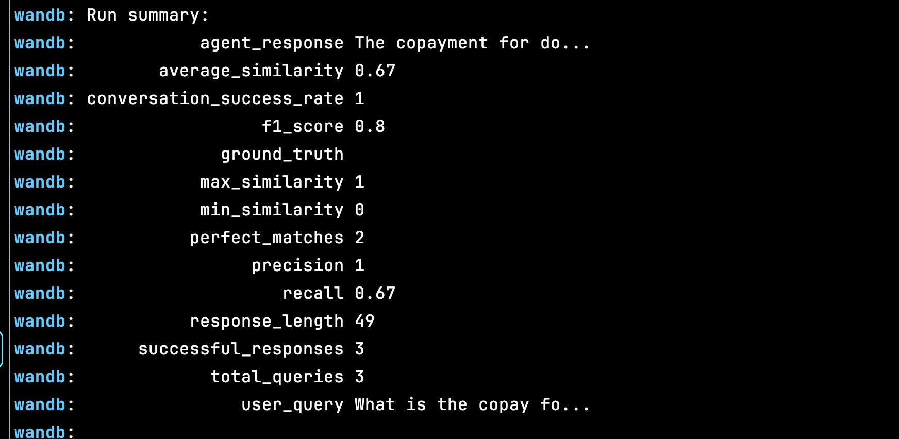

## Configuración del marco de evaluación

nota aclaratoria : La siguiente respuesta estará dividida en dos partes, la explicativa
y un código 

La evaluación como se solicita en el test va a tener dos vertientes desde mi óptica
la primera es ver y evaluar un framework de trabajo desde un pipeline
por lo que usare MLflow para ello, paso seguido usaré Weigths and Biases para 
entender los tiempos de respuesta y hardware  de este proceso.

La prueba que se correrá se hará en máquina local, por lo que 
la respuesta contextual que viene ahora será una respuesta que corresponde 
a cómo hacer esto con AWS :

1. Automatización del despliegue con MLflow , en especial con MLproject como contrato de despliegue
2. Se implementaría un controlador de tiempo real como  cloudwatch para ver el desempeño del sistema 
3. A nivel de LLMs, se puede utilizar un esquema de LLMops con validación del tipo F1-Score, esto para medir la varianza del modelo
4. Si el sistema es integrado No usaría una métrica directa de satisfacción del usuario por lo que considero agresiva ese tipo de tratamientos, haría un scrore de cuantas preguntas hizo para llegar a una respuesta satisfactoria o si hay tasa de abandono
5. Hay algo que en lo personal considero importante frente al usuario (a veces menos amigable hacia los costos del sistema) y es la latencia, para ello usaría el motor de weigths and biases para evaluar dichas respuestas

Ahora supongamos el siguiente escenario

```{bash}
evaluation_framework/
├── main.py                
├── modules/
│   ├── evaluation.py      
│   ├── latency_tracker.py 
│   ├── data_drift.py      
│   ├── feedback.py        
└── utils/
    ├── config.py          

```


### Evaluation module 

```{python}
from sklearn.metrics import precision_score, recall_score, f1_score

def calculate_metrics(true_labels, predicted_labels):
    """
    Calculate evaluation metrics for LLM responses.

    Parameters
    ----------
    true_labels : list
        Ground truth labels for the responses.
    predicted_labels : list
        Labels predicted by the LLM.

    Returns
    -------
    dict
        A dictionary containing precision, recall, and F1-score.
    """
    precision = precision_score(true_labels, predicted_labels, average='weighted')
    recall = recall_score(true_labels, predicted_labels, average='weighted')
    f1 = f1_score(true_labels, predicted_labels, average='weighted')

    return {
        "precision": precision,
        "recall": recall,
        "f1_score": f1
    }

```


### Latency

```{python}
import time

def track_latency(func):
    """
    Decorator to track the latency of a function.

    Parameters
    ----------
    func : callable
        Function to measure latency for.

    Returns
    -------
    callable
        A wrapped function that logs its execution time.
    """
    def wrapper(*args, **kwargs):
        start_time = time.time()
        result = func(*args, **kwargs)
        latency = time.time() - start_time
        print(f"Latency: {latency:.3f} seconds")
        return result, latency

    return wrapper
```


### Data Drift 

```{python}
from evidently import ColumnMapping
from evidently.metrics import DataDriftTable
from evidently.report import Report
import pandas as pd

def detect_data_drift(reference_data, current_data):
    """
    Detect data drift between reference and current datasets.

    Parameters
    ----------
    reference_data : pd.DataFrame
        Dataset used as a baseline for comparison.
    current_data : pd.DataFrame
        Dataset representing the current production data.

    Returns
    -------
    dict
        Report on data drift.
    """
    column_mapping = ColumnMapping()
    report = Report(metrics=[DataDriftTable()])
    report.run(reference_data=reference_data, current_data=current_data, column_mapping=column_mapping)

    return report.show(mode="inline")


```

### Interaction tracker 

```{python}
import json

class InteractionTracker:
    """
    Tracks user-agent interactions for a single conversation.
    """
    def __init__(self, log_file="interaction_log.json"):
        self.log_file = log_file
        self.interactions = []
        self.conversation_id = 0

    def start_conversation(self):
        """
        Initialize a new conversation.
        """
        self.conversation_id += 1
        self.interactions
```

### main program 
```{python}
from modules.evaluation import calculate_metrics
from modules.latency_tracker import track_latency
from modules.data_drift import detect_data_drift
from modules.InteractionTracker import InteractionTracker
from models.local_model import generate_response
import pandas as pd

# Load local datasets
reference_data = pd.read_csv("reference_data.csv")
current_data = pd.read_csv("current_data.csv")

@track_latency
def llm_query(query):
    """
    Query the 🧑🏻‍💻 LLM for a response.
    """
    return generate_response(query)

# Main execution
if __name__ == "__main__":
    query = 'Which leather belt is better in terms of durability and user ratings, a Montblanc or a Boss?'# (Just a made-up example, I have no idea about belts).
    response, latency = llm_query(query)
    print(f"Response: {response}")

    # Metrics calculation
    true_labels = [1, 1]  # 1 = Relevant
    predicted_labels = [1, 0]  # Simulate predictions
    metrics = calculate_metrics(true_labels, predicted_labels)
    print("Evaluation Metrics:", metrics)

    # Detect data drift
    print("Detecting Data Drift...")
    drift_report = detect_data_drift(reference_data, current_data)

    # Collect user feedback
    feedback = collect_feedback(response, 5)  # User rates as excellent
    print("User Feedback:", feedback)
```


With a framework like this, we could achieve the following results.

