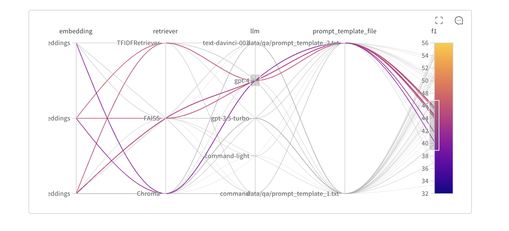

### Discuss how you would detect and manage data drift and model decay in the deployed system. What tools or techniques would you use to ensure the LLM remains effective over time? What metrics would you track? 

To manage data drift and model decay in LLM systems, tools like **Weights & Biases** (W&B) can be leveraged for continuous monitoring and structured evaluation:

1. **Monitoring and traceability**: W&B allows logging predictions, metrics, and data distributions. This helps identify shifts in model behavior and flags the need for retraining or configuration adjustments.

2. **Evaluation and tuning**: Use `Prompts` and dynamically generated evaluation datasets. Metrics like F1 and semantic similarity assess predictions against reference truth.

3. **Iterative optimization**: Hyperparameter sweeps (`Sweeps`) enable fine-tuning of components such as temperature, prompts, or base models (e.g., GPT-4 vs. GPT-3.5-Turbo, claude or gpt-4o-2024-08-06) to maximize key metrics.

4. **Key metrics to track**:
   - **Data distribution**: Compare current inputs with training data.
   - **Accuracy and F1**: Evaluate precision and coverage.
   - **Costs**: Monitor token usage and response times.

### System Performance 

